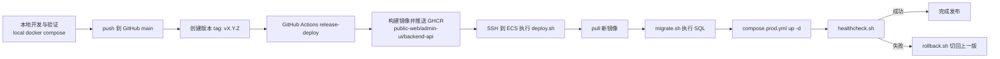

# AliECS 自动部署总说明（最小可用闭环）

> 目标：把“手动可运行”升级为“可重复、可记录、可迁移”的自动部署。

## 1. 当前现状（基于仓库）

### 1.1 已有 GitHub Actions
- `ci.yml`：在 PR/`main` push 时做 Python 语法、Shell 语法、compose 配置检查、以及本地镜像构建检查。
- `release-deploy.yml`：在 `v*` tag（或手工 workflow_dispatch）触发时，构建并推送 3 个业务镜像到 GHCR，然后 SSH 到 ECS 执行 `/opt/app/deploy/ecs/deploy.sh <tag>`。

### 1.2 已有部署脚本链
- `deploy.sh`：拉镜像 -> 迁移 -> 切换 -> 健康检查 -> 失败回滚。
- `migrate.sh`：确保 postgres 启动后执行 `db/migrations/*.sql`。
- `healthcheck.sh`：轮询 `HEALTHCHECK_URL`。
- `rollback.sh`：读取上一版元信息并回滚。

### 1.3 本次补齐点
- 生产 compose 与本地 compose 分离：
  - 本地：`local/docker-compose.local.yml`
  - 生产：`deploy/ecs/compose.prod.yml`（拉 GHCR 镜像、仅监听 127.0.0.1 端口）
- 补齐示例配置：
  - `deploy/ecs/release-meta.env.example`
  - `deploy/ecs/runtime.env.example`
- 脚本日志落盘：`/opt/app/deploy/ecs/logs/deploy-YYYYMMDD.log`
- 可选 ECS 侧自动同步：`deploy/ecs/auto-sync.sh`

---

## 2. 目标自动部署流程（主路径）



---

## 3. 目录职责
- 本地开发入口：`local/docker-compose.local.yml`
- 生产部署入口：`deploy/ecs/deploy.sh`
- 生产编排文件：`deploy/ecs/compose.prod.yml`
- 迁移脚本：`deploy/ecs/migrate.sh`
- 健康检查：`deploy/ecs/healthcheck.sh`
- 回滚脚本：`deploy/ecs/rollback.sh`
- 自动同步（可选）：`deploy/ecs/auto-sync.sh`
- 运行时变量模板：`deploy/ecs/release-meta.env.example`、`deploy/ecs/runtime.env.example`

---

## 4. GitHub Secrets 清单（自动部署所需）

| Secret 名称 | 用途 | 必填 |
|---|---|---|
| `ECS_HOST` | ECS 公网 IP 或域名 | 是 |
| `ECS_USER` | SSH 登录用户（如 `root` / `ubuntu`） | 是 |
| `ECS_SSH_KEY` | 私钥内容（PEM）供 Actions SSH 登录 | 是 |
| `GHCR_USERNAME` | ECS 拉 GHCR 私有镜像登录账号（通过 SSH 动态注入到 deploy.sh） | 私有镜像时必填 |
| `GHCR_TOKEN` | ECS 拉 GHCR 私有镜像令牌（PAT，`read:packages`） | 私有镜像时必填 |

> 说明：Actions 侧“推送镜像”使用 `GITHUB_TOKEN`；ECS 侧“拉取私有镜像”需要 `GHCR_USERNAME/GHCR_TOKEN`。

---


## 5. GHCR unauthorized 根因与修复
- **根因**：Actions 推镜像成功不代表 ECS 有拉镜像权限。若 GHCR 包是 private，ECS 在 `docker compose pull` 前未登录 GHCR，就会出现 `unauthorized`。
- **本次修复**：
  1. `release-deploy.yml` 增加 `GHCR_USERNAME/GHCR_TOKEN` 注入到远程 `deploy.sh`。
  2. `deploy.sh` 在 `pull` 前检测并执行 `docker login ghcr.io`。
  3. 文档明确私有镜像需要 `read:packages` PAT。
- **可选方案**：若你不想管理令牌，可把 GHCR 包改成 public（安全要求允许时）。

---

## 6. ECS 侧标准化约定
- 固定项目目录：`/opt/app`
- 固定部署脚本目录：`/opt/app/deploy/ecs`
- 固定 compose（生产）：`/opt/app/deploy/ecs/compose.prod.yml`
- 固定运行时 env：`/opt/app/deploy/ecs/runtime.env`
- 固定发布元信息：`/opt/app/deploy/ecs/.release-meta`
- 固定日志目录：`/opt/app/deploy/ecs/logs`
- 固定 Nginx 配置：`/etc/nginx/conf.d/aliecs.conf`

---

## 7. 首次部署步骤（简版）
1. 在 ECS 安装 Docker / Compose / Nginx。
2. 准备 `/opt/app` 并拉取仓库。
3. 复制 `release-meta.env.example -> release-meta.env`，改强密码。
4. 在 GitHub 配置 `ECS_HOST/ECS_USER/ECS_SSH_KEY`。
5. 本机或 ECS 手工跑一次：`./deploy/ecs/deploy.sh vX.Y.Z`。
6. 验证：`./deploy/ecs/healthcheck.sh`。

详细命令见：`docs/ecs-first-deploy-checklist.md`。

---

## 8. 日常更新部署（推荐）
1. 本地开发并合入 `main`。
2. **触发方式 A（推荐）**：打 tag `vX.Y.Z` 并 push，自动部署该 tag。
3. **触发方式 B（手工）**：在 Actions 页面 `workflow_dispatch` 输入 `image_tag`（必须 `v*`）。
4. 等待 Actions 执行发布。
5. 查看 ECS 健康检查与日志。

---

## 9. 故障排查步骤
1. 看 Actions 日志（构建/推送/SSH）。
2. 看 ECS 部署日志：
   - `tail -n 300 /opt/app/deploy/ecs/logs/deploy-$(date +%Y%m%d).log`
3. 看容器状态和日志：
   - `docker compose --env-file /opt/app/deploy/ecs/runtime.env -f /opt/app/deploy/ecs/compose.prod.yml ps`
   - `docker compose --env-file /opt/app/deploy/ecs/runtime.env -f /opt/app/deploy/ecs/compose.prod.yml logs --tail=200`
4. 验证健康检查 URL 与 Nginx 转发是否一致。
5. 必要时执行回滚。

---

## 10. 回滚步骤
```bash
cd /opt/app
./deploy/ecs/rollback.sh
./deploy/ecs/healthcheck.sh
```

---

## 11. 新服务器复用步骤
1. 按 `docs/ecs-first-deploy-checklist.md` 完整执行基础准备。
2. 拉取同一仓库，复制示例 env。
3. 配置同名 GitHub Secrets（如有新主机需更新 `ECS_HOST`/`ECS_SSH_KEY`）。
4. 先手工试跑一个已存在 tag，确认 deploy/healthcheck 正常。
5. 再切回 tag 自动发布。

---

## 12. 手动部署 -> 自动部署迁移步骤
1. 保留本地调试链路：`local/docker-compose.local.yml`（不改）。
2. ECS 仅使用 `deploy/ecs/compose.prod.yml` + `deploy.sh`。
3. 先做一次手工 `deploy.sh <tag>` 验证。
4. 配好 GitHub Secrets。
5. 用新 tag 触发 Actions 自动发布。
6. 若发布成功，后续统一走 tag 自动发布，不再在 ECS 现场 build 源码。

---

## 13. 过渡方案说明（还不适合全自动的场景）
- 若暂时不想用 tag，可先用 `workflow_dispatch` 手工触发 `release-deploy.yml` 并填写 `image_tag`。
- 若网络/权限限制导致 GHCR 无法拉取，可临时使用 `auto-sync.sh`（ECS 拉源码 build），但应视为过渡，不是长期生产主路径。

---

## 14. 首页设计改造依据（Claude 风格）
- 设计规范文件：仓库根目录 `DESIGN.md`。
- 视觉参考来源：VoltAgent/awesome-design-md 中 Claude 的 `DESIGN.md`（温暖纸张底色、克制排版、清晰分区、工具型页面结构）。
- 实施范围：`services/public-web/index.html`，用于项目官网入口，不影响 `admin-ui` 与 `backend-api`。
